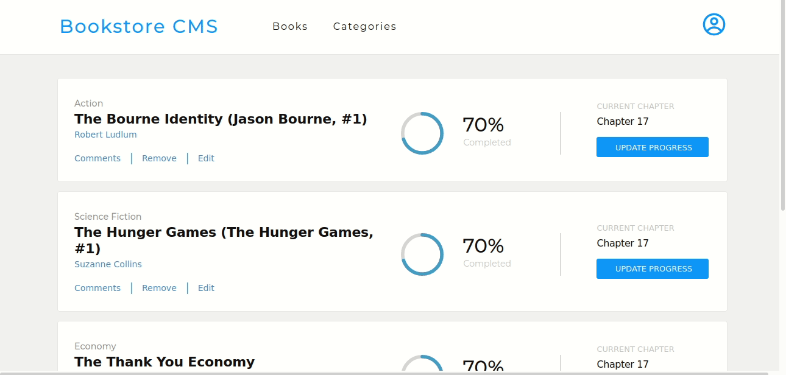

# Bookstore


> The Bookstore is a React-Redux application connected to an existing API to create and remove books in a remote server. Users can **Display the list of books**, **Add** and **Remove a selected book**.



## Live Demo

You can see [the app live here](https://sahar-abdelsamad.github.io/bookstore/)

## Setup

### Clone this repository

```bash
$ git clone git@github.com:Sahar-AbdelSamad/bookstore.git
$ cd bookstore
```

### Run project

```bash
$ npm install
$ npm run start
```

## Built With

- React
- Redux
- Webpack
- JavaScript
- CSS
- API

## Authors

👤 **Sahar Abdel Samad**

- GitHub: [@sahar-abdelsamad](https://github.com/Sahar-AbdelSamad)
- Twitter: [@abdelsamadsahar](https://twitter.com/AbdelSamadSahar)
- LinkedIn: [abdel-samad-sahar](https://www.linkedin.com/in/sahar-abdel-samad/)

## 🤝 Contributing

Contributions, issues, and feature requests are welcome!

Feel free to check the [issues page](https://github.com/Sahar-AbdelSamad/bookstore/issues).

## Show your support

Give a ⭐️ if you like this project!
